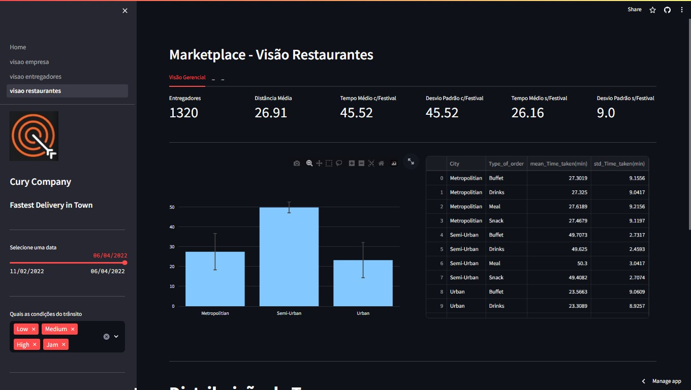

# Curry Company

- Para visualizar o produto final do projeto acesse a página web: https://dashboards-projects-fnord-curry-company.streamlit.app/

## 1. Problema de Negócio

A Cury Company é uma empresa de tecnologia que criou um aplicativo que conecta restaurantes, entregadores e pessoas. 

Através desse aplicativo, é possível realizar o pedido de uma refeição, em qualquer restaurante cadastrado, e recebê-lo no conforto da sua casa por um entregador também cadastrado no aplicativo da Cury Company.

A empresa realiza negócios entre restaurantes, entregadores e pessoas, e gera muitos dados sobre entregas, tipos de pedidos, condições climáticas, avaliação dos entregadores e etc. Apesar da entrega estar crescento, em termos de entregas, o CEO não tem visibilidade completa dos KPIs de crescimento da empresa.

Você foi contratado como um Cientista de Dados para criar soluções de dados para entrega, mas antes de treinar algoritmos, a necessidade da empresa é ter um os principais KPIs estratégicos organizados em uma única ferramenta, para que o CEO possa consultar e conseguir tomar decisões simples, porém importantes.

A Cury Company possui um modelo de negócio chamado Marketplace, que fazer o intermédio do negócio entre três clientes principais: Restaurantes, entregadores e pessoas compradoras. Para acompanhar o crescimento desses negócios, o CEO gostaria de ver as seguintes métricas de crescimento:

### 1.1 Visão Empresa:
1. Quantidade de pedidos por dia.
2. Quantidade de pedidos por semana.
3. Distribuição dos pedidos por tipo de tráfego.
4. Comparação do volume de pedidos por cidade e tipo de tráfego.
5. A quantidade de pedidos por entregador por semana.
6. A localização central de cada cidade por tipo de tráfego.

### 1.2 Visão Estregadores:
1. A menor e maior idade dos entregadores.
2. A pior e a melhor condição de veículos.
3. A avaliação médida por entregador.
4. A avaliação média e o desvio padrão por tipo de tráfego.
5. A avaliação média e o desvio padrão por condições climáticas.
6. Os 10 entregadores mais rápidos por cidade.
7. Os 10 entregadores mais lentos por cidade.

### 1.3 Visão Restaurantes:
1. A quantidade de entregadores únicos.
2. A distância média dos resturantes e dos locais de entrega.
3. O tempo médio e o desvio padrão de entrega por cidade.
4. O tempo médio e o desvio padrão de entrega por cidade e tipo de pedido.
5. O tempo médio e o desvio padrão de entrega por cidade e tipo de tráfego.
6. O tempo médio de entrega durantes os Festivais.

## 2. Estratégia da Solução
- Construir um relatório com as princípais KPIs estratégicos para o CEO faça a consulta e gere insights das visões (segmentações das análises) solicitadas
- Como informado no problema de negócio, o modelo de negócio é markeplace.
- Foi decidido criar uma página no streamlit no formato de app, para armazenar as análises gráficas solicitadas.
- Para todas as páginas de visualização de dados foram adicionados filtros de data e tipo de condição de trânsito a pedido do CEO.

### 2.1 Página Home:
- A página Home tem a função de instruir o usuários ao iniciar a página web com as análises.

### 2.2 Visão Empresa:

#### Visão geral
- Histórico de Pedidos por dia;
- Proporção de pedidos por tipo de trafego
- Quantidade de pedidos por cidade;

#### Visão Tática
- Histórico de pedidos por semana
- Histórico de pedidos de entregadores únicos na semana

#### Visão Geográfica
- Mapa das cidades que a empresa atua.

### 2.3 Visão Entregadores:

- Entregador mais velho;
- Entregador mais novo;
- Detalhes das avaliações dos entregadores, também por trânsito e por clima;
- Detalhe dos Top entregadores mais rápidos;
- Detalhe dos Top entregadores mais lentos.

### 2.4 Visão Restaurante:
- Quantidade de entregadores;
- Distância média de entregas (km);
- Tempo médio de entregas com Festival;
- Tempo médio de entregas sem Festival;
- Desvio Padrão do tempo de entregas sem Festival;
- Tempo média e Desvio Padrão de entregas por cidade;
- Detalhes de tempo de Entrega;
- Distribuição de Tempo por cidade e por Densidade de Tráfego.

## 3. Tecnologias usadas
- **Python:**
  - **Pandas:** Extração, tratamento dos dados, construções de análises.
  - **Numpy:** Contrução das análises gráficas.
  - **Folium:** Construção de visualização de mapa.
  - **Streamlit:** Desenvolvimento da página web, barra lateral, textos, inserção de gráficos, botões de movimentação de página.

## 4. Como executar o projeto
- Para executar o projeto localmente faça o dowlonad das pastas "pages" e "datasets/comunidade_ds" e o arquivo "Home.py". Tendo todas as bibliotecas instaladas na sua interface de desenvolvimento, execute o arquivo Home.py no terminal.
- Utilize os filtros e gráfico interativos para visualização das métricas.

## 5. Top 3 Insights de dados
- Em média, os tempos de entrega durante o festival são aproximadamente o dobro dos tempos de entrega sem o Festival;
  - Sugestão: Realizar uma **análise diganóstica** para entender se existe alguma correlação positiva entre os tempos de entrega e o Festival.
- A quantidade de pedidos registrada históricamente tem uma oscilação diária em que se observa um dia com tendência de queda e no dia seguinte uma tendência de alta. Repetindo este ciclo durante todas as 
  - Exemplo: 
    - 01/03 - 1026;
    - 02/03 - 925;
    - 03/03 - 1059;
    - 04/03 - 899;
    - 05/03 - 1038;
- A condição de tráfego Jam é a segundo colocada em quantidade de pedidos,  entretanto é nesta condição de tráfego que se tem a menor média de avaialiação dos clientes (a única inferior a 4.6);
  - Sugestão: Realizar uma **análise diganóstica** para entender se há alguma relação entre a nota mais baixa e a condição de trânsito.

### 5.1 Outros Insights
- A maior parte dos pedidos é feito em cidades "Metropolititian"
- No período analisado a empresa está com uma tendência de alta no número de pedidos na visão semana a semana
- A cidade "Semi-Urban" possue os maiores tempos médios de entrega, tendo também o menor desvio-padrão entre as cidades

### 5.2 Observações
- Dos dias 20 a 28 de fevereiro e no dia 22 de março não foram registrados nenhum pedido, é válido entender primeiramente com o time de dados se existe algum erro na base de dados fornecida e posteriormente discutir com as áreas de negócio

## 6. Próximos Passos
1. Automatização do dashboard após novo recebimento de dados.
2. Criar novos filtros e visualizações após novo feedback
2. Realizar uma análise diagnóstica para estudo dos insights sugeridos no item 5 e outras solicitações da equipe de RH.

